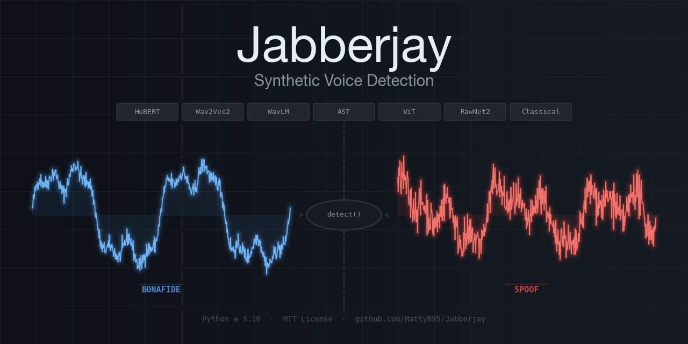

# Jabberjay 🦜

> One API. Every state-of-the-art synthetic voice detector.



<div align="center">

[](https://pypi.org/project/Jabberjay/)
[](https://github.com/MattyB95/Jabberjay/actions/workflows/ci.yml)
[](https://pypi.org/project/Jabberjay/)
[](https://opensource.org/licenses/MIT)
[](https://pypi.org/project/Jabberjay/)
[](https://mattyb95.github.io/Jabberjay)
[](https://doi.org/10.5281/zenodo.19056977)
[](https://github.com/sponsors/MattyB95)
[](https://ko-fi.com/mattyb95)

</div>

---

## Why Jabberjay?

Synthetic voice detection is a fragmented landscape — state-of-the-art models are scattered across research repositories, each with its own dependencies, input formats, and output conventions. Jabberjay brings them all under one consistent Python API and CLI so you can detect AI-generated speech without wrestling with model internals.

- **Seven model families** — ViT, AST, Wav2Vec2, HuBERT, WavLM, RawNet2, and a classical baseline
- **Unified output** — every model returns the same `DetectionResult` with `label`, `confidence`, and `scores`
- **Zero boilerplate** — pass a file path, get a verdict; models are downloaded and cached automatically
- **Flexible** — use strings for quick experiments, enums for IDE autocomplete, or pre-load audio to run multiple models on the same clip

```
$ jabberjay interview.wav
Bonafide ✔️  (94.1% confidence, model=VIT)

$ jabberjay suspicious.wav -m HuBERT
Spoof ❌  (97.8% confidence, model=HuBERT)
```

---

## Installation

```bash
pip install jabberjay
```

Requires Python ≥ 3.10. Models are downloaded from Hugging Face Hub on first use and cached locally.

---

## Quickstart

```python
from Jabberjay import Jabberjay

jj = Jabberjay()
result = jj.detect("audio.wav")

print(result)              # Bonafide ✔️ (94.1% confidence, model=VIT)
print(result.label)        # "Bonafide"
print(result.is_bonafide)  # True
print(result.confidence)   # 0.941
```

---

## Models

### Vision Transformer (ViT)

| **Model**                                                                                                                                                           | **Dataset**   | **Visualisation** |
|---------------------------------------------------------------------------------------------------------------------------------------------------------------------|---------------|-------------------|
| [MattyB95/VIT-ASVspoof2019-ConstantQ-Synthetic-Voice-Detection](https://huggingface.co/MattyB95/VIT-ASVspoof2019-ConstantQ-Synthetic-Voice-Detection)               | ASVspoof2019  | ConstantQ         |
| [MattyB95/VIT-ASVspoof2019-Mel_Spectrogram-Synthetic-Voice-Detection](https://huggingface.co/MattyB95/VIT-ASVspoof2019-Mel_Spectrogram-Synthetic-Voice-Detection)   | ASVspoof2019  | MelSpectrogram    |
| [MattyB95/VIT-ASVspoof2019-MFCC-Synthetic-Voice-Detection](https://huggingface.co/MattyB95/VIT-ASVspoof2019-MFCC-Synthetic-Voice-Detection)                         | ASVspoof2019  | MFCC              |
| [MattyB95/VIT-ASVspoof5-ConstantQ-Synthetic-Voice-Detection](https://huggingface.co/MattyB95/VIT-ASVspoof5-ConstantQ-Synthetic-Voice-Detection)                     | ASVspoof5     | ConstantQ         |
| [MattyB95/VIT-ASVspoof5-Mel_Spectrogram-Synthetic-Voice-Detection](https://huggingface.co/MattyB95/VIT-ASVspoof5-Mel_Spectrogram-Synthetic-Voice-Detection)         | ASVspoof5     | MelSpectrogram    |
| [MattyB95/VIT-ASVspoof5-MFCC-Synthetic-Voice-Detection](https://huggingface.co/MattyB95/VIT-ASVspoof5-MFCC-Synthetic-Voice-Detection)                               | ASVspoof5     | MFCC              |
| [MattyB95/VIT-VoxCelebSpoof-ConstantQ-Synthetic-Voice-Detection](https://huggingface.co/MattyB95/VIT-VoxCelebSpoof-ConstantQ-Synthetic-Voice-Detection)             | VoxCelebSpoof | ConstantQ         |
| [MattyB95/VIT-VoxCelebSpoof-Mel_Spectrogram-Synthetic-Voice-Detection](https://huggingface.co/MattyB95/VIT-VoxCelebSpoof-Mel_Spectrogram-Synthetic-Voice-Detection) | VoxCelebSpoof | MelSpectrogram    |
| [MattyB95/VIT-VoxCelebSpoof-MFCC-Synthetic-Voice-Detection](https://huggingface.co/MattyB95/VIT-VoxCelebSpoof-MFCC-Synthetic-Voice-Detection)                       | VoxCelebSpoof | MFCC              |

### Audio Spectrogram Transformer (AST)

| **Model**                                                                                                                           | **Dataset**   |
|-------------------------------------------------------------------------------------------------------------------------------------|---------------|
| [MattyB95/AST-ASVspoof2019-Synthetic-Voice-Detection](https://huggingface.co/MattyB95/AST-ASVspoof2019-Synthetic-Voice-Detection)   | ASVspoof2019  |
| [MattyB95/AST-ASVspoof5-Synthetic-Voice-Detection](https://huggingface.co/MattyB95/AST-ASVspoof5-Synthetic-Voice-Detection)         | ASVspoof5     |
| [MattyB95/AST-VoxCelebSpoof-Synthetic-Voice-Detection](https://huggingface.co/MattyB95/AST-VoxCelebSpoof-Synthetic-Voice-Detection) | VoxCelebSpoof |

### Wav2Vec2

| **Model**                                                                                                                                       | **Dataset**  |
|-------------------------------------------------------------------------------------------------------------------------------------------------|--------------|
| [Gustking/wav2vec2-large-xlsr-deepfake-audio-classification](https://huggingface.co/Gustking/wav2vec2-large-xlsr-deepfake-audio-classification) | ASVspoof2019 |

### HuBERT

| **Model**                                                                                                         | **Dataset** |
|-------------------------------------------------------------------------------------------------------------------|-------------|
| [abhishtagatya/hubert-base-960h-itw-deepfake](https://huggingface.co/abhishtagatya/hubert-base-960h-itw-deepfake) | In-The-Wild |

### WavLM

| **Model**                                                                                       | **Dataset** |
|-------------------------------------------------------------------------------------------------|-------------|
| [DavidCombei/wavLM-base-Deepfake_V2](https://huggingface.co/DavidCombei/wavLM-base-Deepfake_V2) | Mixed       |

### Other

| **Model** | **Paper**                                                                   | **Codebase**                                                                |
|-----------|-----------------------------------------------------------------------------|-----------------------------------------------------------------------------|
| Classical | —                                                                           | Built-in KNN baseline                                                       |
| RawNet2   | [Tak et al., ICASSP 2021](https://doi.org/10.1109/ICASSP39728.2021.9414234) | [rawnet2-antispoofing](https://github.com/eurecom-asp/rawnet2-antispoofing) |

---

## Usage

### Command Line Interface

```
usage: jabberjay [-h] [-m {AST,Classical,HuBERT,RawNet2,VIT,Wav2Vec2,WavLM}]
                 [-d {ASVspoof2019,ASVspoof5,VoxCelebSpoof}]
                 [-vis {ConstantQ,MelSpectrogram,MFCC}] [-v]
                 audio
```

```bash
# Quickstart — VIT with ConstantQ on VoxCelebSpoof (defaults)
jabberjay audio.wav

# Self-contained models (no dataset or visualisation required)
jabberjay audio.wav -m Wav2Vec2
jabberjay audio.wav -m HuBERT
jabberjay audio.wav -m WavLM
jabberjay audio.wav -m RawNet2

# AST with a specific dataset
jabberjay audio.wav -m AST -d ASVspoof2019

# VIT with full options
jabberjay audio.wav -m VIT -d ASVspoof5 -vis MelSpectrogram

# Verbose output
jabberjay audio.wav -v
```

### Python API

All public names are importable from the top-level package:

```python
from Jabberjay import Jabberjay, DetectionResult, Model, Dataset, Visualisation
```

#### Choosing a model

String names and enum values are both accepted:

```python
jj = Jabberjay()

# Self-contained models — no extra arguments needed
result = jj.detect("audio.wav", model="Wav2Vec2")
result = jj.detect("audio.wav", model="HuBERT")
result = jj.detect("audio.wav", model="WavLM")
result = jj.detect("audio.wav", model="RawNet2")
result = jj.detect("audio.wav", model="Classical")

# AST — requires a dataset
result = jj.detect("audio.wav", model="AST", dataset="VoxCelebSpoof")

# VIT — requires a dataset and a visualisation
result = jj.detect("audio.wav", model="VIT", dataset="ASVspoof5", visualisation="MFCC")

# Enums give IDE autocomplete and catch typos at import time
result = jj.detect(
    "audio.wav",
    model=Model.VIT,
    dataset=Dataset.ASVspoof5,
    visualisation=Visualisation.MFCC,
)
```

#### DetectionResult

Every call to `detect()` returns a `DetectionResult` regardless of the model used:

| Attribute     | Type                 | Description                                                                                                                   |
|---------------|----------------------|-------------------------------------------------------------------------------------------------------------------------------|
| `label`       | `str`                | `"Bonafide"` or `"Spoof"`                                                                                                     |
| `is_bonafide` | `bool`               | `True` if the audio is classified as genuine                                                                                  |
| `confidence`  | `float`              | Confidence score for the top prediction (0.0–1.0)                                                                             |
| `model`       | `Model`              | The model that produced this result                                                                                           |
| `scores`      | `list[dict] \| None` | Full label/score breakdown for VIT, AST, Wav2Vec2, HuBERT, and WavLM (sorted highest-first); `None` for Classical and RawNet2 |

```python
if result.is_bonafide:
    print(f"Genuine voice detected with {result.confidence:.1%} confidence")
else:
    print(f"Synthetic voice detected with {result.confidence:.1%} confidence")

# Full per-label scores
if result.scores:
    for entry in result.scores:
        print(f"  {entry['label']}: {entry['score']:.3f}")
```

#### Pre-loading audio

Use `load()` when running multiple models on the same clip to avoid re-reading the file:

```python
audio = jj.load("audio.wav")  # returns (samples, sample_rate)

results = [
    jj.detect(audio, model="Wav2Vec2"),
    jj.detect(audio, model="HuBERT"),
    jj.detect(audio, model="VIT", dataset="VoxCelebSpoof", visualisation="ConstantQ"),
]
```

#### Discovering available options

```python
jj.list_models()         # prints and returns list[Model]
jj.list_datasets()       # prints and returns list[Dataset]
jj.list_visualisations() # prints and returns list[Visualisation]
```

---

## Examples

The `examples/` directory contains focused, runnable scripts:

| Script                                                  | What it shows                                    |
|---------------------------------------------------------|--------------------------------------------------|
| [`quickstart.py`](examples/quickstart.py)               | Minimum viable usage                             |
| [`choosing_a_model.py`](examples/choosing_a_model.py)   | Every model family, string and enum APIs         |
| [`preloading_audio.py`](examples/preloading_audio.py)   | Efficient multi-model runs with `jj.load()`      |
| [`exploring_results.py`](examples/exploring_results.py) | All `DetectionResult` fields and score breakdown |
| [`run_all.py`](examples/run_all.py)                     | Exhaustive sweep across every model combination  |

```bash
just example                           # run quickstart
just run-example preloading_audio      # run a specific example
just run-all                           # full sweep (slow — downloads all models)
```

---

## Developer Setup

Requires [uv](https://docs.astral.sh/uv/) and [just](https://just.systems/).

```bash
git clone https://github.com/MattyB95/Jabberjay.git
cd Jabberjay
just install   # install all dependencies including dev tools
```

| Command                 | Description                        |
|-------------------------|------------------------------------|
| `just test`             | Run the test suite                 |
| `just check`            | Lint, format check, and type check |
| `just fix`              | Auto-fix lint issues and reformat  |
| `just detect audio.wav` | Run the CLI against a file         |
| `just build`            | Build the package                  |

See `just --list` for all available commands.

---

## Contributing

Contributions are welcome — especially new models! See [CONTRIBUTING.md](CONTRIBUTING.md) for a full guide.

The quickest way to make an impact is to open a [model request issue](https://github.com/MattyB95/Jabberjay/issues/new?template=model_request.yml) with a HuggingFace link and licence details.

---

## Support

If Jabberjay saves you time, consider supporting its development:

- **[GitHub Sponsors](https://github.com/sponsors/MattyB95)** — recurring or one-off support, directly on GitHub
- **[Ko-fi](https://ko-fi.com/mattyb95)** — buy me a coffee

---

## Citation

If you use Jabberjay in your research, please cite it. GitHub's **"Cite this repository"** button (in the sidebar) will generate APA or BibTeX automatically from the `CITATION.cff` file, or you can use the entry below directly:

```bibtex
@software{boakes_jabberjay_2026,
  author  = {Boakes, Matthew},
  title   = {Jabberjay},
  year    = {2026},
  url     = {https://github.com/MattyB95/Jabberjay},
  version = {0.0.8.post2},
  doi     = {10.5281/zenodo.19056977},
}
```

Archived versions are available on [Zenodo](https://doi.org/10.5281/zenodo.19056977). The concept DOI (`10.5281/zenodo.19056977`) always resolves to the latest release.

---

## Acknowledgement

This work was supported, in whole or in part, by the Bill & Melinda Gates Foundation [INV-001309].
